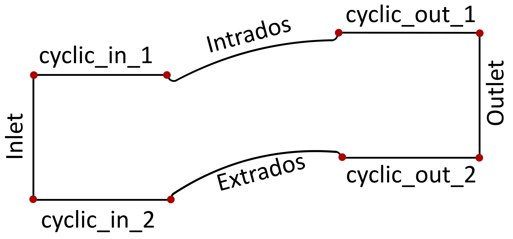

# ROF
> Ravioli implementation for OpenFoam

Python API for easy OpenFOAM's automation. Set up the case's files and control the simulation.

# Table of contents
- [Installing / Getting started](#installing-getting-started)
- [Examples](#example)
- [Links](#links)
- [Licensing](#licensing)

## Installing / Getting started

### Installing
- Installing library:
    Download src folder and then install it via shell.
    ````shell
    python setup.py
    ````
- Copying library:
    Download src folder and copy it to the root folder of your project. Then import it like a normal module.
    ````python
  from Rof.case import Case
    ````

### Getting started


Rof works through a templates that set up the default files with its default values once the standard solver is specified.
The templates can be found in "Rof/pyParFoam/methods_xml" written in xml format.
This templates allow the creation of custom xml with the needed features.

First of all, the Case object must be created,
````python
from Rof.case import Case

# Creating the Case object. 
# The first argument is the path for the case. 
# The second argument is the xml template used to set up the files and its values.

case = Case('', 'rhoCentralFoam')
````

Then change whatever needed,
````python

# All files indicated in the xml file, in this example 'rhoCentralFoam.xml', are ready for 
# change.

# Modifying file U and setting up the boundary conditions
case.file_U.set_field('internalField', 'uniform (10 10 0)')

case.file_U.set_field('boundaryField',
                              {'inlet': {'type': 'freestream',
                                         'freestreamValue': 'uniform (10 10 0)'},
                               'outlet': {'type': 'zeroGradient'},
                               'top_down': {'type': 'empty'}})

# Modifying file p and setting up the boundary conditions
case.file_p.set_field('internalField', 'uniform 10000')
case.file_p.set_field('boundaryField',
                              {'inlet': {'type': 'freestreamPressure'},
                               'outlet': {'type': 'zeroGradient'},
                               'top_down': {'type': 'empty'}})

# Modifying file T and setting up the boundary conditions
case.file_T.set_field('internalField', 'uniform 298')
case.file_T.set_field('boundaryField',
                              {'inlet': {'type': 'fixedValue', 'value': 'uniform 298'},
                               'outlet': {'type': 'zeroGradient'},
                               'top_down': {'type': 'empty'}})

# Modifying file controlDict.
case.file_controlDict.set_field('endTime', '10000')
case.file_controlDict.set_field('startFrom', 'latestTime')
case.file_controlDict.set_field('functions', {"#includeFunc":"MachNo"})

# Modifying file turbulenceProperties.
case.file_turbulenceProperties.set_field('simulationType', 'laminar')
````

When all the files had been modified it is time to build and write the files. There are two ways to write the files:
- Without Simulation Object:
    ````python
    case.build_files()
    ````
    The files are written without creating the Simulation object, so the control of the simulation is lost. 
    But it is possible to run the simulation from the shell, like normal use of OpenFOAM.
- With Simulation Object:
    ````python
    # Building all the files and creating a Simulation object, which allows the control of the simulation
    sim = case.simulation('open40')
    ````

From now on the creation of Simulation object is assumed.
The simulation object is responsible for run commands and controls the simulation flux. 
There are some commands implemented,
- blockMesh
    ````python
    sim.block_mesh(string="string_with_blockMesh_format")
    ````
    or
    ````python
    sim.block_mesh(path="path_to_external_file_with_blockMesh_format")
    ````
- checkMesh
    ````python
    # Returns true if the mesh is fine if it does not return false.
    sim.checkMesh()
    ````
- paraFoam
    ````python
    sim.paraFoam()
    ````

- foamToVTK
    ````python
    sim.foamToVTK()
    ````
    Export results in VTK format, allowing its parse through PyParseVTK tool.

- Not implemented command
    ````python
    sim.not_implemented_command(command, options)
    ````

All the above methods generate a log file in the root directory of the case, called "name_of_command.log".

To run the simulation,
````python
sim.run()
````
The "run" method allows the execution of custom code between iterations, for more information go to [example](#example) and 
see the [documentation](http://rpmcv.eu/rof).

When the simulation is finished it is time to parse the results.
````python
# Export results in VTK format
sim.foamToVTK()

# Get the last results of the "outlet" patch, results is a VTK_File object.
results = sim.get_last_results('outlet')

# Get the results on U, p and T fields from cell.
result_U = results.GetCellData('U')
result_p = results.GetCellData('p')
result_T = results.GetCellData('T')
````
For more information about parse results and the methods of VTK_File go to [documentation](http://rpmcv.eu/rof).

## Example

To resume all the features of the API a complete example will be explained.

The goal of the example is setting up a parametrized cascade blade simulation, run it and parse the results on the outlet. 
The parameters will be the inlet conditions and the geometry, airfoils with different geometry. 



````python
from Rof.case import Case

U_inlet_x = '100'
U_inlet_y = '100'
P_inlet = '10000'
T_inlet = '298'

case = Case('', 'rhoCentralFoam')

case.file_U.set_field('internalField', 'uniform ({} {} 0)'.format(U_inlet_x, U_inlet_y))

case.file_U.set_field('boundaryField',
                              {'inlet': {'type': 'freestream',
                                         'freestreamValue': 'uniform ({} {} 0)'.format(U_inlet_x, U_inlet_y)},
                               'outlet': {'type': 'zeroGradient'},
                               'intrados': {'type': 'fixedValue', 'value':'uniform (0 0 0)'},
                               'extrados': {'type': 'fixedValue', 'value':'uniform (0 0 0)'},
                               'top_down': {'type': 'empty'},
                               'cyclic_in_1': {'type': 'cyclic'},
                               'cyclic_in_2': {'type': 'cyclic'},
                               'cyclic_out_1': {'type': 'cyclic'},
                               'cyclic_out_2': {'type': 'cyclic'}})

case.file_p.set_field('internalField', 'uniform {}'.format(P_inlet))
case.file_p.set_field('boundaryField',
                              {'inlet': {'type': 'freestreamPressure'},
                               'outlet': {'type': 'zeroGradient'},
                               'intrados': {'type': 'zeroGradient'},
                               'extrados': {'type': 'zeroGradient'},
                               'top_down': {'type': 'empty'},
                               'cyclic_in_1': {'type': 'cyclic'},
                               'cyclic_in_2': {'type': 'cyclic'},
                               'cyclic_out_1': {'type': 'cyclic'},
                               'cyclic_out_2': {'type': 'cyclic'}})

case.file_T.set_field('internalField', 'uniform {}'.format(T_inlet))
case.file_T.set_field('boundaryField',
                              {'inlet': {'type': 'fixedValue', 'value': 'uniform {}'.format(args[11])},
                               'outlet': {'type': 'zeroGradient'},
                               'intrados': {'type': 'slip'},
                               'extrados': {'type': 'slip'},
                               'top_down': {'type': 'empty'},
                               'cyclic_in_1': {'type': 'cyclic'},
                               'cyclic_in_2': {'type': 'cyclic'},
                               'cyclic_out_1': {'type': 'cyclic'},
                               'cyclic_out_2': {'type': 'cyclic'}})

case.file_controlDict.set_field('endTime', '10000')
case.file_controlDict.set_field('startFrom', 'latestTime')

# Include a function to calculate the mach number.
case.file_controlDict.set_field('functions', {"#includeFunc":"MachNo"})
case.file_turbulenceProperties.set_field('simulationType', 'laminar')

# Allowing interactivity, the simulation stops every 100 iterations and execute _function.
case.interacting(100)

# Building files and creating the simulation object. Change "open40" for your alias that allow the use of
# openFoam commands.
sim = case.simulation("open40")

# Limit the write of time directories (50 directories).
sim.limit_write = 50

# Create the mesh from an string.
sim.block_mesh(string="string")

# checkMesh
sim.check_mesh()

def _function(container, args):
    current_time = container['current_time']
    if float(current_time)>=0.0002:
        sim.foamToVTK()
        results = sim.get_last_results('outlet')
        result_U = results.GetCellData('U')
        result_p = results.GetCellData('p')
        result_T = results.GetCellData('T')
        theta = 0.0
        z = 0.0
        p=0.0
        t=0.0
        U_length = len(result_U)
        p_length = len(result_p)
        t_length = len(result_T)
        for i,j,k in zip(result_p, result_T, result_U):
            p+= float(i[0])/p_length
            t+= float(j[0])/t_length
            theta += float(k[1])/U_length
            z += float(k[0])/U_length

        args["T"] = t
        args["p"] = p
        args["Theta"] = -theta
        args["z"] = z
        return True
    return False

# run simulation
sim.run(_function, args)
````


## Links

- Project homepage: https://github.com/robertpardillo/rof
- Documentation: http://rpmcv.eu/rof
- Issue tracker: https://github.com/robertpardillo/rof/issues
- Related projects:
  - Rice: https://github.com/robertpardillo/rice
  - Funnel: https://github.com/robertpardillo/funnel

## Licensing
The code in this project is licensed under MIT license.
